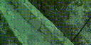
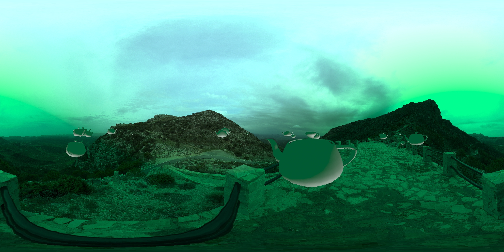

# Скрипт для создания 360-градусных панорам в 3dsmax

В данном наборе представлено несколько скриптов, предназначенные для симуляции снятия панорамного 360-градусного изображения так, словно оно было бы сделано в реальном мире.

Здесь представлено:
* `rotcam1.ms` - скрипт, который добавляет в сцену камеру, немного настраивает рендер и вращает эту камеру так, словно она была бы закреплена на реальном штативе
* `sphere_of_spheres.ms` - расставляет небольшие сферы в виде спиральки, каждая сфера должна быть в центре снимка, таким образом они позволяют визуализировать путь камеры
* `random_teapot.ms` - расставляет чайники на сцене в случайном порядке
* `hdri-sphere.ms` - создает вокруг центра сцены небольшую сферу и натягивает на нее HDRI-картинку (картинка в комплект не входит).

На выходе мы получаем видео от нашей вращающейся камеры:



Это видео потом можно нарезать на кучу картинок и склеить в популярных программах для склейки панорам в одну большую картинку:



Для склейки изображения в данном случае использовался пакет Hugin, но можно использовать практически любой другой. Чтобы избежать многочасового обсчета и поиска контрольных точек, программа генерирует 2 файла с расширениями pto и txt для пакета Hugin, где прописываются все углы камеры, что позволяет склеить панораму сразу, командой вида:
```
\Hugin-2023.0.0-win64\nona -o OUTPUTFILENAME PROJECTNAME.pto
```
Само собой, можно открыть такой pto/menger.txt файл в самом Hugin и покрутить различные параметры, задать размеры панорамы, параметры интерполяции и многое другое.

Траектория движения камеры представлена "спиралью" (запусти файл sphere_of_spheres.ms, чтобы увидеть траекторию), что имеет свои плюсы и минусы:
* Камера делает очень много избыточных снимков на полюсах и может делать недостаточно снимков на экваторе (минус)
* Камера движется с одним вектором движения на протяжении всей съемки, что в реальном мире бы позволило избежать тряски, борьбы с энерцией и люфтов.

Количество снимков определяется по формуле:
```
opticFov=30.0 - горизонтальное поле обзора нашего объектива
cols=360.0/opticFov*3.0 - количество столбцов
rows=180.0/opticFov*3.0 - количество строк
```
Экспериментально было выяснено, чтобы не было дырок при спиральном сканировании, количество нужно умножать на 3. Можете считать это волшебным числом.

Todo:
* Добавить еще алгоритмов вращения камеры, такие как сканирование этажами, или вертикальными полосами
* Создавать CUBE-панорамы
* Самому читать PTO-панорамы и создавать плоскости в пространстве с натянутыми на них картинками (обратный процесс)
* Самому читать PTO и создавать сегменты сферы/многотекстурный материал для одной сферы

Время выполнения этого плана может быть чуть позже, чем заселение альфа-центравра, так что начинать ждать не нужно.

*Внимание!* Хотя это 100% рабочий способ для получения качественных 360-градусных панорам из 3DSMAX, это далеко не самый эффективный и быстрый способ создания панорам в 3dsmax! Зато он максимально приближен к реальному процессу создания реальной панорамы!

*Внимание!* Все параметры и пути к файлам захардкожены внутри скриптов, рекомендуется чтение, понимание и изменение оных перед запуском.

*Внимание!* Это собственный исследовательский проект, написанный для собственного исследования! Дружелюбность к пользователю и его полезность для сторонних людей не являются целями проекта, весь код предоставляется на условии "как есть" и разработчики ни за что не отвечают!
