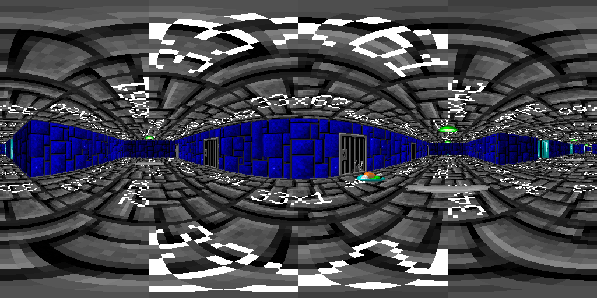

# Скрипт для создания 360-градусных панорам в 3dsmax

В данном наборе представлено несколько скриптов, предназначенные для симуляции снятия панорамного 360-градусного изображения так, словно оно было бы сделано в реальном мире.

Здесь представлено:
* `rotcam1.ms` - скрипт добавляет в сцену камеру, немного настраивает рендер и вращает эту камеру так, словно она была бы закреплена на реальном штативе
* `pano-cube-render.ms` - скрипт добавляет в сцену камеру, настраивает рендер, симулирует снятие 6 снимков по сторонам для cubemap, как это делает штатный экспортер макса в панорамы (вкладка `Utilities` => `Panorama Exporter` => `Render...`). У меня не получилось настроить рендеринг с корректной гаммой из скрипта, потому в конце скрипт делает суффикс `all`, что позволяет отрендерить сцену через диалог рендеринга с корректной гаммой. В отличии от штатного экспортера, тут можно покрутить побольше настроек рендеринга.
* `sphere_of_spheres.ms` - расставляет небольшие сферы в виде спиральки, каждая сфера должна быть в центре снимка, таким образом они позволяют визуализировать путь камеры
* `random_teapot.ms` - расставляет чайники на сцене в случайном порядке (создание тестовой сцены)
* `tile_city.ms` - рисует некоторое подобие города (создание тестовой сцены). Чуток трогает настройки вьюпорта.
* `wolf3d.ms` - уровень из игры Wolfenstein3D от 1992 года (создание тестовой сцены). Инструкция по использованию ниже.
* `hdri-sphere.ms` - создает вокруг центра сцены небольшую сферу и натягивает на нее HDRI-картинку (картинка в комплект не входит).
* `pano-planars.ms` + `pto2atlas.pl` - читать PTO-панорамы и создавать плоскости в пространстве с натянутыми на них картинками (обратный процесс)
* `searchcam.ms` - создает камеру внутри сферы и изучает ее
* `pano-lights.ms` - неудачная попытка проецировать изображения на поверхности при помощи светильников
* `pano-cameras-proj.ms` - создает камеры и качественно проецирует их изображения на поверхности, можно запекать картинки и сравнивать с `Hugin`
* `just-a-sphere.ms` - создает сферу + UV-маппинг, можно использовать для запекания проекции

На выходе мы получаем видео от нашей вращающейся камеры:


Это видео потом можно нарезать на кучу картинок и склеить в популярных программах для склейки панорам в одну большую картинку:


Для склейки изображения в данном случае использовался пакет Hugin, но можно использовать практически любой другой. Чтобы избежать многочасового обсчета и поиска контрольных точек, программа генерирует 2 файла с расширениями pto и txt для пакета Hugin, где прописываются все углы камеры, что позволяет склеить панораму сразу, командой вида:
```
\Hugin-2023.0.0-win64\nona -o OUTPUTFILENAME PROJECTNAME.pto
```
Само собой, можно открыть такой pto/menger.txt файл в самом Hugin и покрутить различные параметры, задать размеры панорамы, параметры интерполяции и многое другое.

Траектория движения камеры представлена "спиралью" (запусти файл sphere_of_spheres.ms, чтобы увидеть траекторию), что имеет свои плюсы и минусы:
* Камера делает очень много избыточных снимков на полюсах и может делать недостаточно снимков на экваторе (минус)
* Камера движется с одним вектором движения на протяжении всей съемки, что в реальном мире бы позволило избежать тряски, борьбы с энерцией и люфтов.

Количество снимков определяется по формуле:
```
opticFov=30.0 - горизонтальное поле обзора нашего объектива
cols=360.0/opticFov*3.0 - количество столбцов
rows=180.0/opticFov*3.0 - количество строк
```
Экспериментально было выяснено, чтобы не было дырок при спиральном сканировании, количество нужно умножать на 3. Можете считать это волшебным числом.

# Wolf3D

Для отладки мне захотелось иметь какую-то красивую сцену, в которой бы была реальная перспектива и по которой бы хотелось ходить, расставлять
объекты в пространстве, но которая была бы достаточно проста как для рендеринга, так и для "дорисовывания" предметов поверх нее. Вспомнилась
замечательная игра, которая произвела революцию в мире компьютерной графики.

Нам понадобятся:
* Оригинальные файлы с ресурсами игры (должен быть файл VSWAP.WL6, который весит 1545400)
* Файлы проекта [Wolf3DExtract](https://github.com/HiPhish/Wolf3DExtract)
* Набор файлов в этом репозитории с префиксом wolf3f_*

Сначала распаковываем палитру через `wolf3d_rgb2color.pl`, потом текстурки через `wolf3d_texture_extract.pl`, потом уровни 
через утильку `wolf3d_extract_maps_extractor.sh` (нужен `Wolf3DExtract`), потом делаем карту через `wolf3d_map2png.pl`.
Осталось только загрузить наши атласы и текстовую карту в 3dsmax через `wolf3d.ms`. Как всегда, все делалось для себя любимого,
все пути захардкожены и вообще каких-то файлов может нехватать. Но вроде бы все должно работать. Если все получилось, то рендерим много-много
картинок в максе, запускаем `wolf3d_pto_creator.pl` и генерим файлы панорам, будет создан `pano_build.bat`, который используя `nona` будет
делать сферические панорамки из cubemaps-ов, которые мы нарендерили. В общем, на выходе будет что-то вроде такого:



Надо бы еще приделать навигацию, но это наверное где-то в неопределенном будущем.

* Взять нормальные названия панорам из level1-max.txt
* Проверить нумерацию тайлов на полу и на потолке
* Сделать нормальную нумерацию тайлов, чтобы потолок совпадал с полом
* Сгенерить точки для точечной навигации
* Сгенерить полигоны для полигональной навигации
* Сохранить как проект pano2vr
* Сохранить как проект panotour
* Сохранить как QTVR (сделать свой компилятор)
* Подрастянуть текстурки на 0.0001 текселя и рендерить их с антиалиасингом
* Апскейлить текстурки в стейбл-дифьюжен???


# Todo:
* Добавить еще алгоритмов вращения камеры, такие как сканирование этажами, или вертикальными полосами

Время выполнения этого плана может быть чуть позже, чем заселение альфа-центравра, так что начинать ждать не нужно.

**Внимание!** Хотя это 100% рабочий способ для получения качественных 360-градусных панорам из 3DSMAX, это далеко не самый эффективный и быстрый способ создания панорам в 3dsmax! Зато он максимально приближен к реальному процессу создания реальной панорамы! Для реального применения в Макс уже встроен экспортер панорам (правда со странными настройками) и куча сторонних рендереров, которые сами умеют рендеринг в сферические картинки!

**Внимание!** Все параметры и пути к файлам захардкожены внутри скриптов, рекомендуется чтение, понимание и изменение оных перед запуском.

**Внимание!** Это собственный исследовательский проект, написанный для собственного исследования! Дружелюбность к пользователю и его полезность для сторонних людей не являются целями проекта, весь код предоставляется на условии "как есть" и разработчики ни за что не отвечают!
